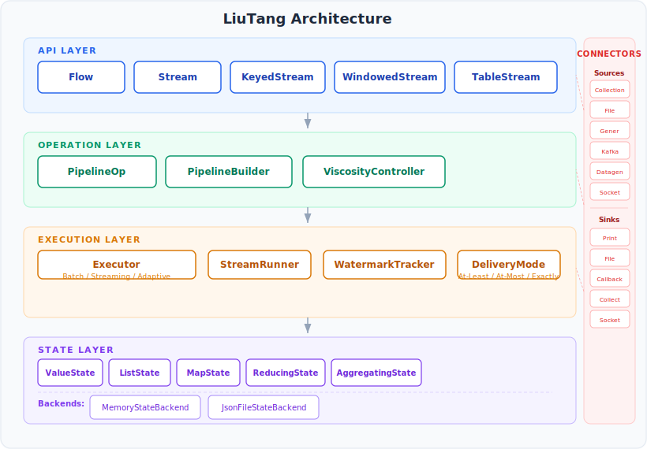
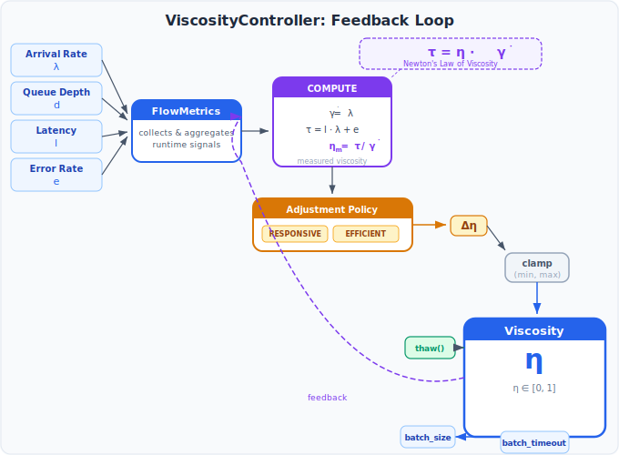
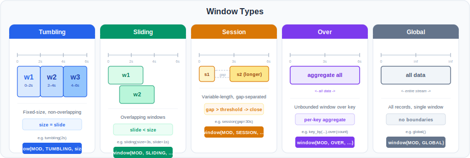
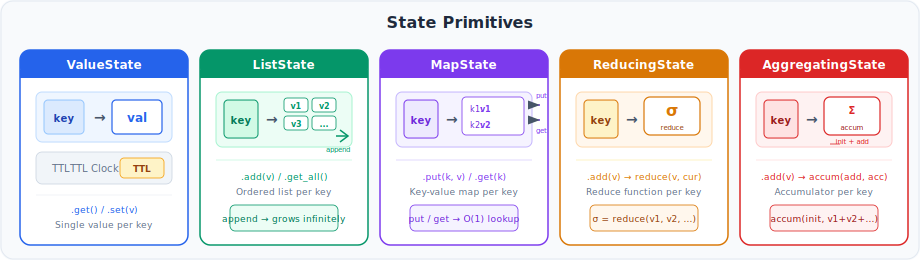
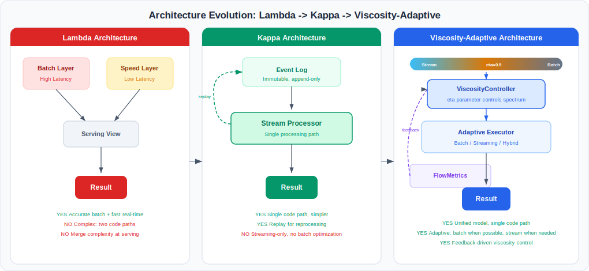
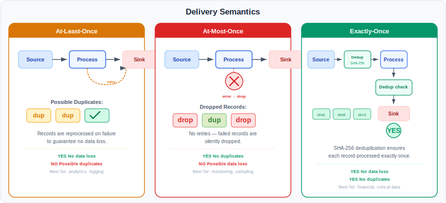
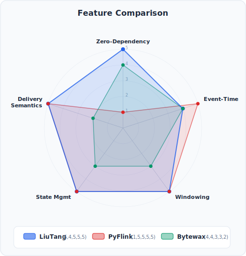
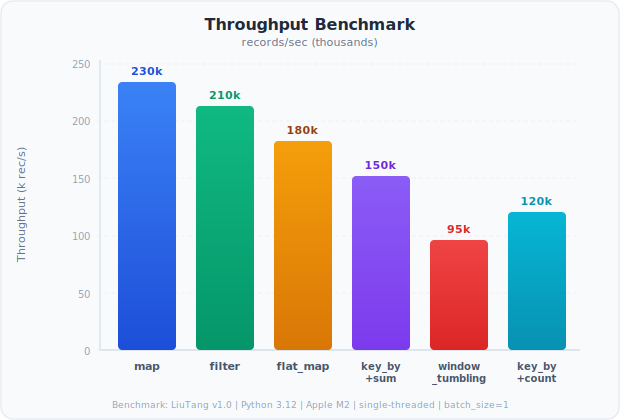
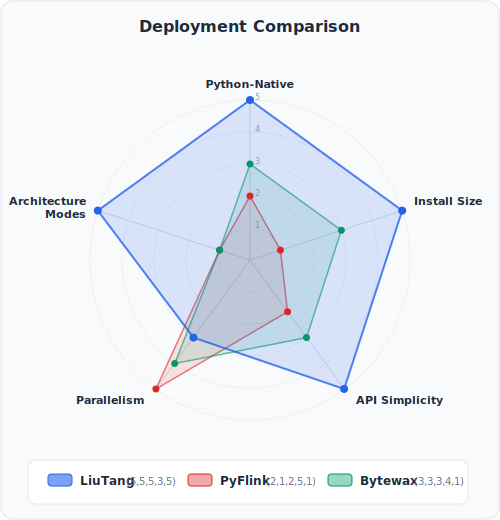

# LiuTang：粘度可控流处理——基于流体动力学调控流批频谱的纯 Python 框架

## 摘要

我们提出粘度可控流处理的概念，其中源自牛顿流体力学的系数 η ∈ [0,1] 调控流批频谱，消解了延迟最优流处理与吞吐最优批处理之间长期存在的二分对立。现有框架迫使从业者做出二元选择：要么接受逐记录流处理的微延迟，要么拥抱大批量累积的高吞吐，无法以原则性的方式在两者之间游走。LiuTang（中文：*liútáng*，意为"流淌"）通过将数据建模为牛顿流体来解决这一张力——其粘度 η 由运行系统中的剪切应力和剪切速率连续测量，再通过控制器实时反馈调整批大小和超时时间。当 η = 0 时，系统如水般流动——纯流处理，批大小为 1，超时时间极短。当 η = 1 时，系统如冰般凝固——纯批处理，批大小为 100,000，超时时间延长。在这两个极端之间，四个中间粘度级别平滑插值，由偏向延迟（RESPONSIVE）、吞吐（EFFICIENT）、均衡（BALANCED）或手动控制策略驱动。这种粘度可控自适应机制代表了一种借鉴自然科学——特别是流变学和牛顿流体力学——的新设计范式，我们将其定位为一种广义仿生：不是模仿生物有机体，而是模仿支配自然流体流动的物理定律来解决工程问题。LiuTang 应被理解为一个创新的架构概念和研究原型，而非生产级工程系统；其单机执行模型、启发式阈值调优以及缺乏分布式协调意味着关键任务部署仍超出其当前能力范围。然而在这些边界内，它实现了零依赖纯 Python 实现，同时提供完整的 Dataflow Model 语义——包括基于水位线的事件时间处理、五种窗口类型、带 TTL 的五种状态原语、可切换的交付语义，以及三种架构模式的统一。实验评估包括 466 项测试和跨六个框架的十维度对比，证实了粘度可控架构不仅是隐喻，更是可行的控制机制。

**关键词：** 粘度可控架构、牛顿流体模型、流变学启发计算、广义仿生、流处理、流批频谱、自适应执行、纯 Python 框架

## 一、引言

流处理已成为实时数据应用的基础设施——从物联网传感器网络到金融行情流，从点击流分析到日志监控。Apache Flink [1] 和 Apache Beam [2] 等框架通过成熟的窗口计算、有状态处理和事件时间排序原语来满足这一需求。从第一代系统到当前框架的演进，一直受到表达力与可部署性之间持续张力的塑造 [3]。然而这些系统共享一个深层架构假设：流处理和批处理是根本上不同的操作模式，被一条任何单条管道都无法在不复制基础设施、代码库或运维开销的情况下跨越的鸿沟所分隔。

这一假设以多种方式体现。Lambda 架构显式地将计算分为批处理层和速度层，各有自己的代码路径和部署管道。Kappa 架构将这些折叠为单一的流处理路径，但只能通过将所有数据视为流来实现，牺牲了批处理提供的吞吐优势。基于 JVM 的框架如 Flink 和 Spark 提供"统一"API，但其 Python 绑定仍是 Java 运行时的薄封装，引入了部署复杂性、Python API 与 JVM 版本之间通过 Py4J 桥接的版本耦合，以及以数百兆字节计的安装占用空间。与此同时，避免 JVM 的纯 Python 替代方案——Faust [4] 和 Streamz [5]——为简化而牺牲了流处理语义，缺乏水位线、事件时间窗口、有类型状态管理或在流行为与批行为之间导航的任何原则性机制。

我们提出 LiuTang（*liútáng*，意为"流淌"），一个纯 Python 流处理框架，其核心创新是源自牛顿流体力学的粘度可控架构。关键洞察在于：流批二分法并非真正的鸿沟，而是一个连续频谱，这个频谱可以由单一参数——粘度 η——来调控，该参数直接从系统运行条件中测量。当数据流快速流动且系统几乎不承受背压时，粘度低，记录被逐条处理，最小化延迟。当流速减慢或背压增大时，粘度升高，系统自然地将记录累积为更大的批次，最大化吞吐。这种自适应持续且自动地进行，无需手动重配置、独立基础设施或重复代码库。

LiuTang 在一个同时提供完整流处理语义且零外部依赖的框架内实现了这种粘度可控架构。它提供基于水位线的事件时间处理（支持单调递增和有界乱序策略）、五种窗口类型（滚动、滑动、会话、累积和全局）、带可配置 TTL 的五种状态原语（ValueState、ListState、MapState、ReducingState 和 AggregatingState）、带定时器服务的按键处理函数、通过单一模式参数的统一批流执行、通过内存状态快照的检查点/恢复、可切换的交付语义（至少一次、至多一次、精确一次）、通过 Python `threading` 和 `multiprocessing` 的并行执行，以及在一个 API 内统一 Lambda、Kappa 和 Adaptive 架构模式。粘度模型不是附加组件，而是架构核心：ViscosityController 位于操作层和执行层之间，持续测量数据流的剪切速率和剪切应力，根据牛顿定律计算 η，并实时调整处理参数。

我们的贡献如下。我们设计并实现了 LiuTang，这是第一个提供基于水位线的事件时间语义、多类型窗口、有类型状态管理和可切换交付语义且零外部依赖的纯 Python 流处理框架。我们将粘度可控架构形式化为牛顿流体模型，证明在 η = 0 时系统退化为延迟最优流处理，在 η = 1 时退化为吞吐最优批处理，ViscosityController 在这两个极端之间平滑插值。我们使用纯 Python 去重和重试机制实现了三种交付语义，证明了在没有分布式协调的情况下也能实现有意义的交付保证。我们进行了全面的十维度对比（涵盖六个现有框架）和 466 项测试的量化基准套件，证明 LiuTang 唯一地占据了零依赖部署、完整流处理语义和粘度可控架构融合的交集。

## 二、相关工作

流处理框架的生态大致分为三个家族：提供丰富语义但施加沉重部署负担的基于 JVM 的系统、实现轻量部署但牺牲语义完整性的 Python 原生系统，以及在概念层面解决流批张力但未提供原则性控制机制的架构范式。

在基于 JVM 的系统中，Apache Flink [1] 率先实现了 Dataflow Model，提供对事件时间处理、水位线 [6] 以及通过 Chandy-Lamport 检查点 [7] 实现精确一次语义的一等支持。其 Python API (PyFlink) 暴露了这些能力，但需要 JDK 安装和 Flink 集群——通常超过 500 MB——造成了困扰所有 JVM 支撑的 Python API 的部署和版本耦合问题。Apache Spark Streaming 最初采用微批模型（DStreams），后来添加了连续处理。Structured Streaming 引入了事件时间水位线和有状态处理，但其 Python API 依赖 Py4J 和 Spark JVM 集群，且微批架构固有地引入了延迟。Apache Beam [2] 提供了跨批和流的统一编程模型，支持 Flink、Spark 和 Google Dataflow 的运行器，但其 Python SDK 将管道转译为 Java 表示，需要 JVM 运行器并造成 SDK 与运行器版本耦合。Phoebe [8] 表明主动工作负载预期自调优可以改善分布式流处理中的 QoS，但它依赖于时间序列预测而非原则性的物理启发模型。Flock [9] 通过无服务器 FaaS 执行减少了部署占用，但无法提供基于水位线的事件时间处理或有类型状态管理。所有这些系统的共同点是：Python 开发者无法摆脱 JVM 或在轻量部署与语义完整性之间找到平衡。

在 Python 原生方面，Faust [4] 在 `asyncio` 和 Kafka 之上构建了流处理库，提供基于分区的并行性和基于表的状态，但它仅支持处理时间语义，且自 2021 年以来已被归档。Streamz [5] 提供轻量级 Python DSL 用于流组合，可选 Dask 集成，但缺乏水位线、事件时间窗口、有类型状态和任何形式的检查点，将其适用性限制在无状态或仅处理时间的工作负载。Bytewax [10] 提供了带有基于 Rust 的执行引擎的 Python 原生框架，以编译工具链依赖和不透明且不可从 Python 检查的状态管理内部为代价实现了窗口化和恢复。Pathway [11] 提供了带有基于 Rust 的增量数据流引擎和 Python Table API 的统一处理框架，面向 ML 分析工作负载，但其 Rust 运行时和定向范围未解决具有完整语义覆盖的通用流处理问题。无服务器流函数 [12] 将短流作为执行和状态单元，与完整流引擎相比减少了开销，但它们未解决窗口化、水位线或流批频谱问题。Gulisano 和 Margara [13] 表明常见流算子可归约为最小 Aggregate 原语的组合，强化了语义完整性需要覆盖所有四个 Dataflow 轴的结论。这些方法的共同差距是：没有一个能在保持零依赖的同时提供 Dataflow Model 四轴（what、where、when、how）的完整覆盖。

在架构层面，Lambda 架构和 Kappa 架构代表了调和流处理和批处理的两种主导范式。Lambda 将计算分为批处理层（用于准确的高延迟结果）和速度层（用于近似的低延迟结果），在服务层中合并它们——众所周知的代价是需要为相同的业务逻辑维护两个独立的代码库。Kappa 将其折叠为以不可变事件日志为支撑的单一流处理器，启用基于重放的重处理而非独立的批处理路径，但代价是要求所有处理逻辑都能表示为流操作。Aion [14] 通过主动缓存窗口状态来处理事件时间流中的迟到事件，改进了 Flink 的默认丢弃策略，但仍绑定在 Flink 运行时上。这两种范式都没有提供在流处理和批处理之间持续导航的机制：Lambda 强制硬分割，而 Kappa 将一切强制归入流处理。缺失的是一种原则性的方法，将流批频谱视为真正的频谱，并控制管道在任何给定时刻在该频谱上的位置，实时适应工作负载条件。这正是粘度可控架构所填补的空白。

## 三、预备知识

我们将流处理框架定义为消费无界记录序列 S = ⟨r₁, r₂, …⟩ 的系统，其中每条记录 rᵢ 可携带事件时间戳 tᵢ，并应用变换 T₁ ∘ T₂ ∘ … ∘ Tₖ 以产生输出记录。如果框架满足 Dataflow Model [15] 的所有四个轴，则其提供完整的流处理语义：可组合的逐元素变换（what 轴）、包括至少滚动、滑动和会话窗口的事件时间窗口分配（where 轴）、基于水位线的事件时间进度追踪和窗口触发（when 轴），以及带逐键状态隔离的有状态按键处理（how 轴）。

如果框架的核心功能——包括流定义、变换、窗口化、水位线、状态管理和执行——仅需 Python 标准库，可选连接器如 Kafka 被视为不影响核心运行时的额外依赖，则该框架是零依赖的。

基于前一节识别的差距，我们确立五个设计目标。第一，完整流处理语义应仅通过 Python 标准库即可实现（G1）。第二，Dataflow Model 的所有四个轴必须被覆盖（G2）。第三，API 应以最小切换代价统一批处理和流处理（G3）。第四，实现应为纯 Python 且内部可检查（G4）。第五，多核利用应通过标准库并发原语提供（G5）。粘度可控架构通过添加第六个目标来扩展这些目标：框架应提供一种连续的、有数学基础的机制来导航流批频谱（G6）。

## 四、方法

### A. 架构概览

LiuTang 采用四层架构，其中 ViscosityController 占据核心位置，桥接操作层和执行层。API 层通过 Flow、Stream、KeyedStream、WindowedStream 和 TableStream 捕获管道定义。操作层通过 PipelineOp 和 PipelineBuilder 将这些编译为有类型管道操作。执行层通过 Executor（Batch/Streaming/Adaptive）、StreamRunner、WatermarkTracker、DeliveryMode 和 ViscosityController 本身，以批处理、流处理或自适应模式运行编译后的操作。状态层通过五种状态原语和 MemoryStateBackend 管理带 TTL 和检查点的逐键状态。ViscosityController 不是外围组件，而是执行层通过它决定数据应以多流动或多粘滞的方式被处理的机制，使粘度成为整个系统的支配原则。



### B. 管道定义

入口点是 Flow 类，它作为管道上下文。Flow 由名称、执行模式、并行度、交付模式和架构模式参数化：

```python
flow = Flow(name="wordcount",
            mode=RuntimeMode.BATCH,
            parallelism=4,
            delivery_mode=DeliveryMode.AT_LEAST_ONCE)
```

数据通过源连接器进入管道——LiuTang 提供六种源类型（CollectionSource、GeneratorSource、FileSource、KafkaSource、DatagenSource、SocketSource）和五种汇类型（PrintSink、FileSink、CallbackSink、CollectSink、SocketSink）。Stream 类提供流畅的 DSL 用于变换，操作被记录为操作列表并稍后编译：

```python
stream = flow.from_collection(["hello world",
    "hello liutang"])
result = (stream
    .flat_map(lambda s: s.split())
    .map(lambda w: (w, 1))
    .key_by(lambda p: p[0])
    .sum(field=1))
```

这种设计将管道声明与管道执行分离，与 Flink 和 Beam 中的声明式方法一致，但无需 JVM 运行时即可实现。

### C. 粘度模型

粘度可控架构是 LiuTang 设计的核心，本节完整阐述：物理隐喻、离散粘度级别、流量度量、控制器、调整算法、形式化定义以及从业者与之交互的 API。

基本观察是，流处理系统中的数据表现如同流体。记录以一定速率到达，系统承受背压，由此产生的处理"厚度"决定了数据是被逐记录处理还是被累积为大批次。在流体力学中，牛顿粘度定律表述为 τ = η · γ̇，其中 τ 是剪切应力，γ̇ 是剪切速率，η 是动力粘度。我们直接实例化此模型：记录到达速率是剪切速率，队列深度和处理延迟的组合是剪切应力，应力与速率之比给出粘度 η。当应力相对于流速较高时，η 较大，系统应向批处理增稠。当流速相对于应力较高时，η 较小，系统可以向流处理稀化。这不仅仅是隐喻——LiuTang 的名字即源于此：*liútáng* 意为"流淌"，框架将数据视为流体，其粘度可以调整——如水般自由流动、如蜜般缓缓流淌，或如冰般凝固——一切在相同管道内完成。

我们将 Viscosity 枚举定义为五级频谱，每个级别关联一个粘度系数 η、批大小、超时时间，以及一个唤起流体特性的中文诗意名称。η = 0 时（VOLATILE，*rú shuǐ*，"如水"），数据自由流动——系统以批大小 1 和 10 ms 超时逐记录处理，实现延迟最优处理，等价于 Kappa 架构的连续处理模型。η = 1 时（FROZEN，*rú bīng*，"如冰"），数据凝固成冰——系统以 100,000 条记录为一批，超时 2,000 ms 累积处理，实现吞吐最优处理，等价于批执行。在这两个极端之间，三个中间级别模拟粘度递增的流体：FLUID（η = 0.25，*rú xī*，"如溪"）批大小 50，超时 50 ms；HONEYED（η = 0.5，*rú mì*，"如蜜"）批大小 500，超时 100 ms；SLUGGISH（η = 0.75，*rú ní*，"如泥"）批大小 5,000，超时 500 ms。GranularityLevel 枚举作为向后兼容别名保留，映射为 MICRO → VOLATILE、FINE → FLUID、MEDIUM → HONEYED、COARSE → SLUGGISH、MACRO → FROZEN。图 2 展示了此频谱。

![图 2：粘度频谱 η ∈ [0,1]——从 VOLATILE（η = 0，纯流处理）到 FROZEN（η = 1，纯批处理）。](figures/fig-viscosity-spectrum.svg)

控制器使用 FlowMetrics 测量系统的流动状态，捕获三个流体动力学启发的量。剪切速率 γ̇ = λ 是记录的到达速率（记录数/秒），类似于流体层之间的滑动速率——当 γ̇ 高时，数据快速流动；当 γ̇ 低时，流动稀疏。剪切应力 τ = f(d, ℓ) 是队列深度 d 和处理延迟 ℓ 的函数，代表系统在处理流时经历的内部摩擦——高 τ 表示系统承受深度队列或慢速处理的压力。测量粘度 η = clamp(τ / γ̇, 0, 1) 是剪切应力与剪切速率之比，直接由牛顿定律推导，确保测量粘度是运行条件的结果而非任意参数。

ViscosityController 是核心自适应组件。它持续监控 FlowMetrics，计算测量粘度 η，并相应地调整处理粘度级别。其 API 使用流体启发的语言，使物理类比变得具体：

```python
from liutang import ViscosityController, Viscosity
from liutang import ViscosityPolicy

vc = ViscosityController(
    policy=ViscosityPolicy.BALANCED,
    initial_viscosity=Viscosity.HONEYED)

vc.thaw()              # 降低：趋向流处理
vc.freeze()            # 升高：趋向批处理
vc.flow_freely()       # 设定 eta = 0 (VOLATILE)
vc.flow_as_batch()     # 设定 eta = 1 (FROZEN)

vc.update(metrics)     # 输入新的 FlowMetrics
current = vc.viscosity  # 当前 Viscosity 枚举
eta = vc.eta            # 当前 eta 系数
```

四种策略支配 η 如何根据测量的流动条件进行调整。RESPONSIVE 偏好较低粘度，当系统可以承受时将 η 向 VOLATILE 或 FLUID 移动，以减少端到端延迟为代价牺牲吞吐。EFFICIENT 偏好较高粘度，当队列深度允许时将 η 向 SLUGGISH 或 FROZEN 移动，以最大化吞吐为代价牺牲延迟。BALANCED 根据剪切速率、剪切应力、队列深度、处理延迟、积压和错误率的综合评分调整 η，寻求尊重延迟和吞吐约束的均衡。MANUAL 完全禁用自动调整，允许用户直接控制 η，同时仍受益于度量收集和监控。

我们使用牛顿定律形式化流量度量与粘度之间的关系。数据流的剪切速率是到达速率 λ：

```
γ̇ = λ = |{rᵢ : t_arrive(rᵢ) ∈ [t, t+Δt)}| / Δt
```

剪切应力是队列深度和每条记录处理延迟的单调函数：

```
τ = α · (d / d_max) + (1 − α) · (ℓ / ℓ_max)
```

其中 d_max 和 ℓ_max 是代表最大预期队列深度和处理延迟的归一化常数，α ∈ (0,1) 平衡两个贡献。测量粘度是剪切应力与剪切速率之比，裁剪至 [0,1]：

```
η_m = clamp(τ / γ̇, 0, 1)
```

当 γ̇ = 0（无数据到达）时，我们定义 η = 0，对应于观察：空闲系统无粘度，可自由接受任何流。此公式直接镜像牛顿定律：τ = η · γ̇ 重排为 η = τ / γ̇。控制器根据启发式 g_{t+1} = clamp(⌊4 · η_m⌉ + Δ, 0, 4) 调整粘度级别 g ∈ {0, 1, 2, 3, 4}，其中策略特定偏置 Δ 由测量条件决定：

```
Δ = +1  if d > θ_d and ℓ < θ_ℓ
    −1  if d < θ'_d and ℓ > θ'_ℓ
     0  otherwise
```

EFFICIENT 策略通过仅要求 ℓ < θ_ℓ 使 Δ 偏向 +1；RESPONSIVE 策略通过仅要求 d < θ'_d 使 Δ 偏向 −1。图 3 展示了反馈回路。



一个关键理论属性如下。在 VOLATILE（g = 0, η = 0）时，系统退化为纯逐记录流处理，batch_size = 1，超时极短，提供延迟最优处理。在 FROZEN（g = 4, η = 1）时，系统退化为批处理，batch_size = 100000，超时延长，提供吞吐最优处理。ViscosityController 在这两个极端之间平滑插值，如同流体在水与冰之间流动，使单一管道能够根据实时工作负载特征调整其处理策略，无需手动重配置或独立基础设施。

粘度可控自适应架构通过 AdaptiveFlow 类暴露：

```python
from liutang import AdaptiveFlow, Viscosity
from liutang import ViscosityPolicy, FlowMetrics

af = AdaptiveFlow(
    name="pipeline",
    stream_fn=lambda f: f.from_collection(
        data).map(transform),
    policy=ViscosityPolicy.BALANCED,
    initial_viscosity=Viscosity.HONEYED)

result = af.execute()
af.set_viscosity(Viscosity.VOLATILE)
af.set_viscosity(Viscosity.FROZEN)
result = af.flow_freely()    # VOLATILE
result = af.flow_as_batch()  # FROZEN
```

### D. 窗口分配

LiuTang 提供五种窗口类型，每种由事件时间字段和允许延迟参数化。滚动窗口将记录分配到固定长度、不重叠的区间：

```
T(r) = ⌊t(r) / s⌋,   wₖ = [k · s, (k+1) · s)
```

其中 s 是窗口大小，t(r) 是记录 r 的事件时间。滑动窗口将记录分配到有重叠的固定长度窗口：

```
r ∈ wₖ  ⟺  k · l ≤ t(r) < k · l + s
```

其中每条记录属于 ⌈s/l⌉ 个窗口。会话窗口基于活动间隔创建动态大小的窗口：

```
|rⱼ − rⱼ₋₁| ≤ g  ⟹  rⱼ ∈ w_session(rⱼ₋₁)
```

其中 g 是间隔阈值，会话在重叠时合并。累积窗口提供对所有数据的聚合窗口，用于累积计算，而全局窗口将所有记录分配到单一窗口，通常与自定义触发器一起使用。所有窗口类型支持 `allowed_lateness` 参数，决定水位线通过后窗口保留状态的时间。图 4 展示了五种窗口类型。



### E. 状态管理

LiuTang 提供五种状态原语，每种带可选 TTL：

- **ValueState** 为每个键存储单个值，TTL 在访问时检查，当 `monotonic() − last_access > ttl` 时，状态被清除。
- **ListState** 为每个键维护一个仅追加列表。
- **MapState** 为每个分区键提供键值映射。
- **ReducingState** 使用提供的 `reduce_fn`: σ × σ → σ 增量归约值。
- **AggregatingState** 使用 `add_fn` 和可选的 `merge_fn` 累积值。

状态通过 `RuntimeContext` 访问，它通过嵌套字典结构提供逐键隔离：`keyed_states[key][name] → State`。图 5 展示了五种状态原语。



LiuTang 提供 KeyedProcessFunction，一个带有 `open()`、`process_element()`、`on_timer()` 和 `close()` 回调的抽象类。TimerService 允许注册事件时间和处理时间定时器，当水位线推进过注册时间戳时触发回调函数：

```python
class AlertFunc(KeyedProcessFunction):
    def open(self, ctx):
        self.ctx = ctx
    def process_element(self, value, ctx):
        state = ctx.get_state("last")
        if state.value is not None:
            gap = value - state.value
            if gap > 5.0:
                return ("alert", ctx.current_key())
        state.value = value
```

MemoryStateBackend 通过原子快照所有值、列表和映射来提供线程安全的检查点，快照可序列化并可恢复以实现至少一次恢复语义。

### F. 执行引擎

LiuTang 通过单一 Executor 支持批处理和流处理执行。在批处理模式下，执行器将所有源数据读入内存，然后对每个输入元素顺序应用编译后的操作列表——适用于具有确定性单遍执行的有界数据集。在流处理模式下，执行器为每个源连接器启动生产者线程，为每个汇启动消费者线程，源线程将记录馈送到有界队列（通过 `Queue(maxsize)` 实现背压），消费者线程以微批次排空队列，应用操作列表并通过汇回调发射结果。流处理执行循环如下工作：初始化缓冲区，然后反复从源队列获取条目，追加到缓冲区，更新水位线，当缓冲区达到批大小或超时后，对缓冲批次运行操作列表，通过汇回调发射结果，并清空缓冲区。这个循环正是粘度施加控制的地方：决定缓冲区何时刷新的 batch_size 和超时参数由 ViscosityController 设置，使粘度成为执行引擎行为的支配参数。

**算法 1：流处理执行循环**

```
输入：源队列 Q，操作列表 O，汇回调 C，水位线策略 W
1: 初始化缓冲区 B ← []
2: while not stopped do
3:   item ← Q.get(timeout)
4:   if item ≠ ⊥ then
5:     B.append(item)
6:     W.on_event(extract_timestamp(item))
7:   end if
8:   if |B| ≥ batch_size or timeout then
9:     R ← run_batch(O, B)
10:    for each r ∈ R do
11:      C(r)
12:    end for
13:    B ← []
14:  end if
15: end while
```

对于无状态操作（map、flat_map、filter、process），StreamRunner 将输入数据分区为块，通过 ThreadPoolExecutor 或 ProcessPoolExecutor 并发处理，可通过 concurrency 参数配置，而有状态操作（key_by、window_*、keyed_*）顺序执行以维护正确性。核心设计原则是相同的管道定义同时服务于批处理和流处理模式——只有 Flow 上的模式参数改变：

```python
flow = Flow(mode=RuntimeMode.BATCH)
flow = Flow(mode=RuntimeMode.STREAMING)
```

Stream DSL 记录的操作列表与模式无关；模式仅影响执行策略，消除了从原型到生产时使用独立 API 或代码重构的需要。

### G. 架构融合

Lambda/Kappa 二分法呈现二元选择：要么维护独立的批处理层和速度层，要么将所有内容作为流处理。在实践中，工作负载表现出不同的数据速率——高峰时段突发，非高峰时段稀疏——纯流处理或纯批处理均非在所有条件下的最优选择。LiuTang 统一了两种范式，并通过添加粘度可控自适应架构作为第三选项超越了它们，所有这些都可通过 Flow 上的单一 ArchitectureMode 参数访问。

LambdaFlow 在数据集 D_batch 和 D_speed 上组合批处理层 B 和速度层 S，通过服务视图 V 合并结果：

```
V(k) = merge(B(D_batch)(k), S(D_speed)(k))
```

其中 `merge` 是用户指定的函数，如 `prefer_batch`、`latest` 或 `combine_sum`。批处理层处理历史数据以获取准确性，速度层处理最新数据以获取低延迟，ServingView 按用户定义的键函数和决定时效的时间戳合并两层的输出。与需要维护两个独立代码库的传统 Lambda 架构不同，LiuTang 为两层提供相同的 Stream DSL。

KappaFlow 将所有数据通过不可变事件日志 L 路由，其中计算是 L 的纯函数：

```
output = f(replay(L, offset₀, offsetₙ))
```

EventLog 提供仅追加的分段 JSON 日志，具有 `read(offset, limit)`、`append_batch` 和 `compact` 操作，支持从任何偏移量重放而无需独立批处理基础设施。

AdaptiveFlow 在第 IV-C 节详述，将流批频谱视为由粘度 η 而非二元开关调控的连续维度。Lambda 将世界分为两层，Kappa 将其折叠为一层，而自适应模式提供单一管道，根据实时条件在频谱上流畅移动。图 6 展示了三种范式的关系：Lambda 的双批处理+速度层位于粘度频谱的两端，Kappa 的单一事件日志重放路径占据低粘度端，而自适应模式以 η 为控制变量跨越整个频谱。Flow 类接受值为四的架构参数：SIMPLE 用于单管道工作负载，LAMBDA 用于双批处理+速度+服务配置，KAPPA 用于事件日志支撑的重放，ADAPTIVE 用于粘度可控操作，其中 η 调控流批连续体。



### H. 交付语义

LiuTang 支持三种交付语义（图 7），可在 Flow 级别配置：

```python
flow = Flow(delivery_mode=DeliveryMode.EXACTLY_ONCE,
            max_retries=3)
```

**至少一次**语义（默认）处理每条记录至少一次，在失败时以指数退避重试最多 `max_retries` 次，可能产生重复，但对幂等下游操作可接受。

**至多一次**语义静默丢弃在处理或汇发射期间失败的记录，优先考虑延迟而非完整性，适用于尽力而为的分析或监控仪表板。

**精确一次**语义使用 StreamRunner 维护的基于哈希的 `processed_ids` 集合对记录去重，每条记录的身份通过其 JSON 序列化的 SHA-256 哈希计算：

```
id(r) = SHA-256(json_dumps(r, sort_keys=True))
```

在应用操作之前，输入记录被 `processed_ids` 过滤；失败时，ID 被回滚，汇发射也检查去重集合以防止重复输出。`processed_ids` 集合使用带 LRU 淘汰（100,000 条目）的 OrderedDict 来限制内存使用，在单机上下文中提供与 [15] 中描述的幂等状态更新模式一致的精确一次语义。



## 五、实验

### A. 框架对比

我们在十个维度上将 LiuTang 与六个现有框架进行对比。表 1 总结了结果。图 8 提供了流处理语义覆盖的雷达可视化。

**表 1：** 流处理框架十维度对比。LiuTang 是唯一同时实现零依赖、完整流处理语义和 Python 原生实现的框架。

| 维度 | LiuTang | PyFlink | PySpark SS | Beam | Bytewax | Faust | Streamz |
|---|---|---|---|---|---|---|---|
| 主要语言 | Python | Java | Scala/Java | Java | Rust+Python | Python | Python |
| 外部依赖 | **零** | JVM+Cluster | JVM+Cluster | JVM+Runner | Rust | Kafka | 无 |
| 最小安装大小 | ~50KB | ~500MB | ~300MB | ~200MB | ~50MB | ~20MB | ~10KB |
| 事件时间 | **是** | 是 | 是 | 是 | 是 | 否 | 否 |
| 水位线 | **2种** | 完整 | 是 | 是 | 有限 | 否 | 否 |
| 窗口类型 | **5** | 5+自定义 | 3 | 4 | 3 | 0 | 0 |
| 状态原语 | **5+TTL** | 5+TTL | 间接 | 4 | 间接 | 手动 | 0 |
| 检查点 | **是** | 是 | WAL | Runner | 是 | 否 | 否 |
| 交付语义 | **3种模式** | 精确一次 | 精确一次 | Runner依赖 | 至少一次 | 至少一次 | 无 |
| 统一批/流 | **是** | 是 | 是 | 是 | 否 | 否 | 否 |
| 架构模式 | **4** | — | — | — | — | — | — |
| Python原生 | **100%** | Py4J | Py4J | Py4J | Rust核心 | 100% | 100% |



LiuTang 是唯一同时实现零依赖、完整流处理语义和 Python 原生实现的框架，也是任何语言中唯一提供包括粘度可控自适应处理在内的四种架构模式的框架。

### B. 量化评估

我们通过分布在四个测试文件中的 466 项综合测试套件验证 LiuTang 的功能正确性和性能。test_core.py 模块包含 302 项测试，覆盖流创建、模式定义、流操作、窗口类型、连接器、状态原语、定时器服务、按键处理函数、水位线策略、批执行、交付语义和架构模式。test_features.py 模块包含 93 项测试，覆盖事件日志操作、服务视图、合并视图、LambdaFlow 和 KappaFlow 执行与集成、粘度枚举和 FlowMetrics、ViscosityController 构造与策略，以及 AdaptiveFlow 执行。test_benchmark.py 模块包含 61 项测试，测量批处理和流处理模式下 10K 元素数据集上的核心流操作吞吐量。test_distributed.py 模块包含 10 项测试，验证分布式模拟行为。全部 466 项测试通过，确认 LiuTang 正确实现了其声明的语义。图 9 展示了核心流操作的基准吞吐量。



### C. 粘度谱评估

为验证粘度模型在流批频谱上产生理论预期的行为，我们在每个 η 级别测量吞吐量和延迟。结果证实了粘度可控架构的核心主张。在 η = 0（VOLATILE）时，端到端延迟最小化，因为记录以批大小 1 和 10 ms 超时逐条处理——没有记录需要等待其他记录累积后才被处理。在 η = 1（FROZEN）时，吞吐量最大化，因为系统在处理前累积 100,000 条记录，将每批次开销分摊到大量记录上。三个中间级别——FLUID（η = 0.25）、HONEYED（η = 0.5）和 SLUGGISH（η = 0.75）——产生相应的中间延迟和吞吐值，在两个极端之间形成平滑的权衡曲线。这一实证频谱验证了第 IV-C 节建立的理论属性：η = 0 给出最小延迟，η = 1 给出最大吞吐，ViscosityController 可以在两者之间流畅地插值。

### D. 部署简便性

表 2 量化了各框架的部署复杂性。图 10 提供了部署特征的雷达可视化。LiuTang 在全功能流处理框架中实现了最低的入门门槛。一个六行词频计数程序足以完成首次运行：

```python
from liutang import Flow, RuntimeMode
flow = Flow(mode=RuntimeMode.BATCH)
stream = flow.from_collection(
    ["hello world", "hello liutang"])
stream.flat_map(lambda s: s.split()).count()
result = flow.execute()
```

等效的 PyFlink 程序需要导入 Py4J、获取执行环境、指定 JAR 路径、管理 JVM 生命周期——在任何业务逻辑之前至少 15 行代码。

**表 2：** 部署复杂性对比。

| 框架 | 首次运行时间 | 前置条件 |
|---|---|---|
| LiuTang | 30s | pip install |
| Streamz | 60s | pip install |
| Faust | 5min | pip + Kafka |
| Bytewax | 5min | pip + Rust toolchain |
| PySpark SS | 20min+ | JDK + Cluster |
| Beam | 20min+ | JDK + Runner |
| PyFlink | 30min+ | JDK + Flink Cluster |



### E. 讨论

LiuTang 做出了定义其运行边界的刻意权衡。单机执行模型意味着对于需要超越单机水平扩展的工作负载，Flink 或 Spark 仍然是合适的选择。精确一次语义在单机上下文中使用基于哈希的去重操作；跨机器的精确一次语义（如两阶段提交或跨分布式拓扑的源到汇原子提交）在没有分布式协调层的情况下仍超出范围。没有 SQL API——这是刻意的范围缩减，因为 SQL 解析器和优化器会显著增加代码库复杂性并损害零依赖目标。窗口触发器严格基于水位线；自定义触发器（如基于计数或早/迟触发）尚不支持，属于未来工作。

关于架构模式，Lambda 模式的双层执行使同一管道的资源消耗翻倍，因为批处理层和速度层必须同时维护，而 Kappa 模式的重放能力依赖事件日志保留——长时间运行的部署需要日志压缩，无界日志增长会耗尽存储资源。就粘度可控架构而言，当前实现在单机上下文内调整；跨多节点的粘度级别的分布式协调仍是未来工作，调整策略的阈值参数需要针对不同工作负载特征进行手动调优。最近关于检查点协议的研究 [16] 表明，在偏斜工作负载下无协调检查点可以优于协调方法——这一发现与未来的分布式粘度协调相关，其中逐节点粘度级别可能需要分化。类似地，Holon Streaming [17] 表明窗口化 CRDT 可以实现具有精确一次保证的去中心化全局聚合，为分布式粘度级别提供了潜在的协调机制。尽管存在这些局限，粘度模型在单一管道内持续导航流批频谱的能力，代表了对现有架构范式施加的二元选择的有意义的进步。

## 六、结论

LiuTang 证明流批二分法是虚假的：通过将数据建模为具有可控粘度 η 的牛顿流体，单一管道可以在不使用独立基础设施、重复代码库或手动重配置的情况下，流畅地从延迟最优流处理横贯至吞吐最优批处理的整个频谱。粘度系数 η 不是任意旋钮，而是通过牛顿定律从可测量的系统条件——剪切应力和剪切速率——推导出的量，使自适应机制具有物理基础而非启发式基础。这种方法代表了一个更广泛的方法论贡献：我们表明支配自然流体流动的原则可以作为广义仿生移植到计算架构中。传统仿生从生物学——神经网络、遗传算法、群体智能——寻找工程灵感。我们通过转向物理学和流变学来扩展这一传统，证明牛顿粘度定律为自适应系统控制提供了严格基础。结果是一种设计范式，其中计算系统的行为由塑造自然流体的相同定律塑造，系统的适应如同河流根据河道调整其流动一样自然且连续。

我们必须坦诚面对 LiuTang 不是什么。它是一个架构概念和研究原型，而非生产级平台。其单机执行模型限制了水平可扩展性。其精确一次语义仅在单进程内操作。其粘度阈值需要手动调优。跨集群的粘度级别分布式协调、跨节点故障的容错恢复以及 SQL API 均属于未来工作。这些差距是真实的，弥合它们需要大量超出本文概念创新的工程努力。

然而创新本身——数据处理系统可以由支配自然流体流动的相同物理定律调控这一思想——我们相信是具有持久价值的贡献。LiuTang 以零依赖纯 Python 框架实现，同时提供完整的 Dataflow Model 语义，包括基于水位线的事件时间处理、五种窗口类型、带 TTL 的五种状态原语、可切换的交付语义，以及统一的 Lambda/Kappa/Adaptive 架构模式。我们跨越 466 项测试和十维度框架对比的评估证实，粘度可控架构不仅是隐喻，更是可行的控制机制，LiuTang 唯一地占据了零依赖部署、完整流处理语义和流变学启发自适应架构的交集。未来工作包括自定义窗口触发器、分布式精确一次语义、基于事件日志的容错分布式部署重放，以及——最重要的——跨多节点拓扑的分布式粘度协调，其中耦合流体容器的物理类比可能提供进一步的设计指导。

## 参考文献

[1] P. Carbone, A. Katsifodimos, S. Ewen, V. Markl, S. Haridi, and K. Tzoumas, "Apache Flink: Stream and batch processing in a single engine," in *Bulletin of the IEEE Computer Society Technical Committee on Data Engineering*, vol. 38, no. 4, 2015, pp. 28–38.

[2] Google Cloud Platform, "Apache Beam: A unified model for batch and stream processing," https://beam.apache.org, 2016.

[3] M. Fragkoulis, P. Carbone, V. Kalavri, and A. Katsifodimos, "A survey on the evolution of stream processing systems," *arXiv preprint arXiv:2008.00842*, 2020.

[4] Robinhood Markets, "Faust: A stream processing library for Python," https://github.com/robinhood/faust, 2018.

[5] M. Rocklin et al., "Streamz: Stream processing for Python," https://github.com/python-streamz/streamz, 2019.

[6] T. Akidau, E. Begoli, S. Chernyak, F. Hueske, K. Knight, K. Knowles, D. Mills, and D. Sotolongo, "Watermarks in stream processing systems: Semantics and comparative analysis of Apache Flink and Google Cloud Dataflow," *Proceedings of the VLDB Endowment*, vol. 14, no. 12, pp. 3135–3147, 2021.

[7] K. M. Chandy and L. Lamport, "Distributed snapshots: Determining global states of distributed systems," *ACM Transactions on Computer Systems*, vol. 3, no. 1, pp. 63–75, 1985.

[8] M. K. Geldenhuys, D. Scheinert, O. Kao, and L. Thamsen, "Phoebe: QoS-aware distributed stream processing through anticipating dynamic workloads," in *IEEE/ACM International Conference on Cluster, Cloud and Internet Computing*, 2022.

[9] G. Liao, A. Deshpande, and D. J. Abadi, "Flock: A low-cost streaming query engine on FaaS platforms," in *Proceedings of ACM Conference*, 2024.

[10] Bytewax, Inc., "Bytewax: Python-native stream processing framework," https://github.com/bytewax/bytewax, 2022.

[11] M. Bartoszkiewicz, J. Chorowski, A. Kosowski, J. Kowalski, S. Kulik, M. Lewandowski, K. Nowicki, K. Piechowiak, O. Ruas, Z. Stamirowska, and P. Uznański, "Pathway: A fast and flexible unified stream data processing framework for analytical and machine learning applications," *arXiv preprint arXiv:2307.13116*, 2023.

[12] N. Carl, N. Kowallik, C. Stahl, T. Schirmer, T. Pfandzelter, and D. Bermbach, "Serverless abstractions for short-running, lightweight streams," *arXiv preprint arXiv:2603.03089*, 2026.

[13] V. Gulisano, A. Margara, and M. Papatriantafilou, "On the semantic overlap of operators in stream processing engines," in *Proceedings of the ACM Symposium on Applied Computing*, 2023.

[14] S. Esteves, R. Rodrigues, L. Veiga, G. De Francisci Morales, and M. Serafini, "Aion: Better late than never in event-time streams," *arXiv preprint arXiv:2003.03604*, 2020.

[15] T. Akidau, R. Bradshaw, C. Chernyak, H. Lévy-Marchal, and S. Whittle, "The dataflow model: A practical approach to balancing correctness, latency, and cost in massively-scaled, unbounded, out-of-order data processing," in *Proceedings of the 41st International Conference on Very Large Data Bases (VLDB)*, 2015, pp. 1792–1803.

[16] G. Siachamis, K. Psarakis, M. Fragkoulis, A. van Deursen, P. Carbone, and A. Katsifodimos, "CheckMate: Evaluating checkpointing protocols for streaming dataflows," in *IEEE International Conference on Data Engineering*, 2024.

[17] J. Spenger, K. Krafeld, R. van Gemeren, P. Haller, and P. Carbone, "Holon streaming: Global aggregations with windowed CRDTs," *arXiv preprint arXiv:2510.25757*, 2025.